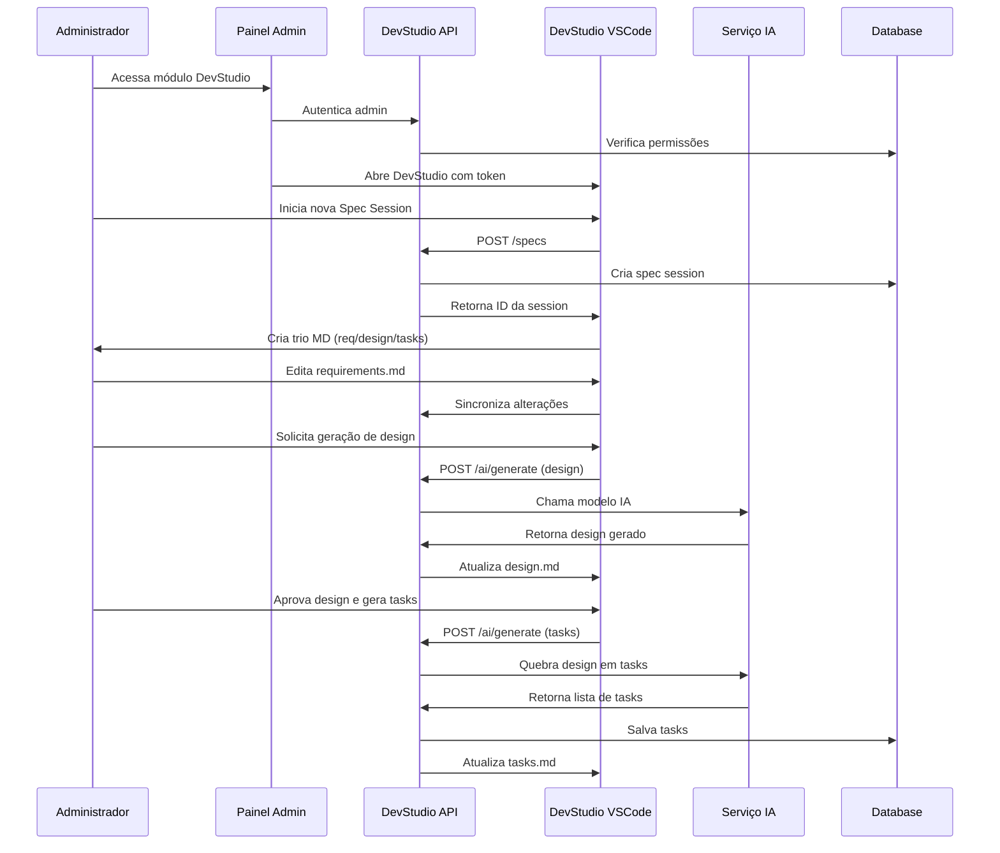
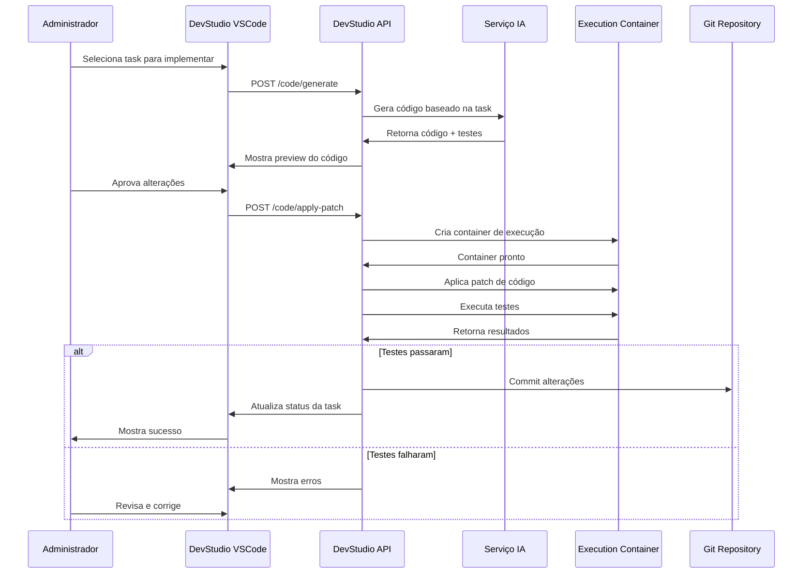
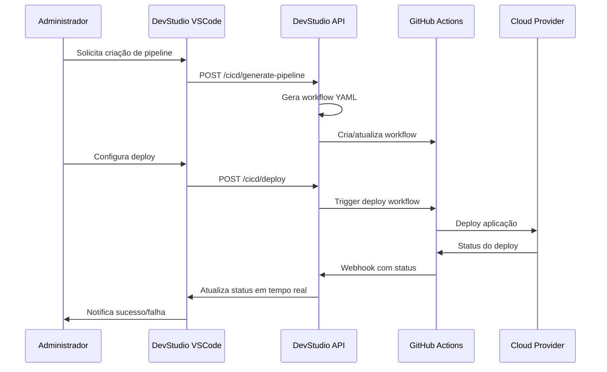

# Módulo de Programação RENUM DevStudio - Design Técnico

## Arquitetura Geral

### Visão de Alto Nível

```
┌─────────────────────────────────────────────────────────────┐
│                    RENUM Admin Panel                        │
├─────────────────────────────────────────────────────────────┤
│  ┌─────────────────┐  ┌─────────────────┐  ┌─────────────── │
│  │   Dashboard     │  │   User Mgmt     │  │  DevStudio    │ │
│  │                 │  │                 │  │   Module      │ │
│  └─────────────────┘  └─────────────────┘  └─────────────── │
└─────────────────────────────────────────────────────────────┘
                                │
                                ▼
┌─────────────────────────────────────────────────────────────┐
│                DevStudio Backend API                        │
├─────────────────────────────────────────────────────────────┤
│  ┌─────────────┐ ┌─────────────┐ ┌─────────────┐ ┌────────── │
│  │ Spec Mgmt   │ │ Code Gen    │ │ Execution   │ │ CI/CD    │ │
│  │ Service     │ │ Service     │ │ Service     │ │ Service  │ │
│  └─────────────┘ └─────────────┘ └─────────────┘ └────────── │
└─────────────────────────────────────────────────────────────┘
                                │
                                ▼
┌─────────────────────────────────────────────────────────────┐
│                  VSCode Fork (DevStudio)                    │
├─────────────────────────────────────────────────────────────┤
│  ┌─────────────────────────────────────────────────────────┐ │
│  │           RENUM DevStudio Agent Extension               │ │
│  │  ┌─────────────┐ ┌─────────────┐ ┌─────────────┐      │ │
│  │  │ Spec        │ │ Code        │ │ Execution   │      │ │
│  │  │ Sessions    │ │ Generator   │ │ Runner      │      │ │
│  │  └─────────────┘ └─────────────┘ └─────────────┘      │ │
│  └─────────────────────────────────────────────────────────┘ │
└─────────────────────────────────────────────────────────────┘
```

## Componentes Principais

### 1. DevStudio Backend API

#### 1.1 Estrutura de Diretórios
```
apps/devstudio-api/
├── app/
│   ├── api/v1/
│   │   ├── specs.py           # Gerenciamento de Spec Sessions
│   │   ├── projects.py        # CRUD de projetos
│   │   ├── code_generation.py # Geração de código
│   │   ├── execution.py       # Execução e testes
│   │   ├── cicd.py           # Integração CI/CD
│   │   └── ai_orchestration.py # Orquestração de IA
│   ├── services/
│   │   ├── spec_service.py
│   │   ├── code_service.py
│   │   ├── execution_service.py
│   │   ├── cicd_service.py
│   │   └── ai_service.py
│   ├── repositories/
│   │   ├── spec_repository.py
│   │   ├── project_repository.py
│   │   └── execution_repository.py
│   ├── schemas/
│   │   ├── spec.py
│   │   ├── project.py
│   │   ├── execution.py
│   │   └── ai.py
│   └── core/
│       ├── config.py
│       ├── security.py
│       └── container_manager.py
├── containers/
│   ├── execution/
│   │   ├── Dockerfile.node
│   │   ├── Dockerfile.python
│   │   └── Dockerfile.generic
│   └── templates/
├── migrations/
└── tests/
```

#### 1.2 Endpoints Principais

```python
# Spec Sessions
POST   /api/v1/spec-sessions            # Criar nova spec session
GET    /api/v1/spec-sessions            # Listar spec sessions
GET    /api/v1/spec-sessions/{id}       # Obter spec session
PUT    /api/v1/spec-sessions/{id}       # Atualizar spec session
DELETE /api/v1/spec-sessions/{id}       # Deletar spec session
POST   /api/v1/spec-sessions/{id}/sync  # Sincronizar MD ↔ DB

# Projetos
POST   /api/v1/projects                 # Criar projeto
GET    /api/v1/projects                 # Listar projetos
GET    /api/v1/projects/{id}            # Obter projeto
PUT    /api/v1/projects/{id}            # Atualizar projeto
DELETE /api/v1/projects/{id}            # Deletar projeto
POST   /api/v1/projects/{id}/clone      # Clonar projeto

# Planejamento e Geração
POST   /api/v1/plan                     # Gerar plano de tasks (requirements → design → tasks)
POST   /api/v1/code/generate            # Gerar código
POST   /api/v1/code/refactor            # Refatorar código
POST   /api/v1/code/apply               # Aplicar patch assinado
POST   /api/v1/code/preview             # Preview de alterações
GET    /api/v1/code/templates           # Listar templates

# Execução
POST   /api/v1/exec                     # Enfileirar job (test/build/deploy)
GET    /api/v1/exec/{id}                # Status de execução
GET    /api/v1/exec/{id}/logs           # Logs em tempo real
POST   /api/v1/exec/test                # Executar testes
POST   /api/v1/exec/build               # Build do projeto

# CI/CD
POST   /api/v1/ci/generate-pipeline     # Gerar pipeline
POST   /api/v1/ci/deploy                # Deploy do projeto
GET    /api/v1/ci/status/{project_id}   # Status atual do pipeline
POST   /api/v1/ci/report                # Callback de status de CI
POST   /api/v1/ci/rollback              # Rollback

# IA Orchestration (sem chaves no cliente)
POST   /api/v1/ai/generate              # Rotear para modelos
GET    /api/v1/ai/models                # Modelos disponíveis
POST   /api/v1/ai/optimize              # Otimizar prompt/contexto

# Admin APIs
GET    /api/admin/devstudio/projects    # Projetos para painel admin
GET    /api/admin/devstudio/stats       # Estatísticas de uso
GET    /api/admin/devstudio/users       # Usuários ativos
```

### 2. Banco de Dados

#### 2.1 Schema DevStudio (Atualizado)
```sql
-- Schema dedicado
CREATE SCHEMA devstudio;

-- Projetos (com multi-tenant obrigatório)
CREATE TABLE devstudio.ds_projects (
    id UUID PRIMARY KEY DEFAULT gen_random_uuid(),
    tenant_id UUID NOT NULL, -- Multi-tenant obrigatório
    name VARCHAR(100) NOT NULL,
    description TEXT,
    type VARCHAR(50) NOT NULL, -- 'web', 'api', 'mobile', 'integration'
    template VARCHAR(50),
    repo VARCHAR(500), -- URL do repositório
    provider VARCHAR(20), -- 'github', 'gitlab'
    created_by UUID NOT NULL REFERENCES auth.users(id),
    created_at TIMESTAMP WITH TIME ZONE DEFAULT NOW(),
    updated_at TIMESTAMP WITH TIME ZONE DEFAULT NOW(),
    status VARCHAR(20) DEFAULT 'active', -- 'active', 'archived', 'deleted'
    source_module VARCHAR(20) DEFAULT 'devstudio', -- Rastreamento
    metadata JSONB DEFAULT '{}'::jsonb
);

-- Spec Sessions (com source_module)
CREATE TABLE devstudio.ds_spec_sessions (
    id UUID PRIMARY KEY DEFAULT gen_random_uuid(),
    project_id UUID NOT NULL REFERENCES devstudio.ds_projects(id),
    title VARCHAR(200) NOT NULL,
    description TEXT,
    status VARCHAR(20) DEFAULT 'draft', -- 'draft', 'active', 'completed'
    author_id UUID NOT NULL REFERENCES auth.users(id), -- Renomeado de created_by
    created_at TIMESTAMP WITH TIME ZONE DEFAULT NOW(),
    updated_at TIMESTAMP WITH TIME ZONE DEFAULT NOW(),
    completed_at TIMESTAMP WITH TIME ZONE,
    version INTEGER DEFAULT 1,
    source_module VARCHAR(20) DEFAULT 'devstudio',
    metadata JSONB DEFAULT '{}'::jsonb
);

-- Specs (requirements, design, tasks) com versionamento
CREATE TABLE devstudio.ds_specs (
    id UUID PRIMARY KEY DEFAULT gen_random_uuid(),
    session_id UUID NOT NULL REFERENCES devstudio.ds_spec_sessions(id),
    type VARCHAR(20) NOT NULL, -- 'requirements', 'design', 'tasks'
    content TEXT NOT NULL,
    version INTEGER DEFAULT 1,
    created_by UUID NOT NULL REFERENCES auth.users(id),
    created_at TIMESTAMP WITH TIME ZONE DEFAULT NOW(),
    updated_at TIMESTAMP WITH TIME ZONE DEFAULT NOW(),
    source_module VARCHAR(20) DEFAULT 'devstudio'
);

-- Tasks com assignee e DoD
CREATE TABLE devstudio.ds_tasks (
    id UUID PRIMARY KEY DEFAULT gen_random_uuid(),
    session_id UUID NOT NULL REFERENCES devstudio.ds_spec_sessions(id),
    title VARCHAR(200) NOT NULL,
    description TEXT,
    status VARCHAR(20) DEFAULT 'todo', -- 'todo', 'in_progress', 'review', 'done'
    assignee VARCHAR(10) DEFAULT 'agent', -- 'agent', 'human' (simplificado)
    dod TEXT, -- Definition of Done
    priority VARCHAR(10) DEFAULT 'medium', -- 'low', 'medium', 'high'
    estimated_hours INTEGER,
    actual_hours INTEGER,
    created_at TIMESTAMP WITH TIME ZONE DEFAULT NOW(),
    updated_at TIMESTAMP WITH TIME ZONE DEFAULT NOW(),
    completed_at TIMESTAMP WITH TIME ZONE,
    links JSONB DEFAULT '[]'::jsonb, -- PRs, commits, etc.
    source_module VARCHAR(20) DEFAULT 'devstudio',
    metadata JSONB DEFAULT '{}'::jsonb
);

-- Execuções (renomeado para ds_runs)
CREATE TABLE devstudio.ds_runs (
    id UUID PRIMARY KEY DEFAULT gen_random_uuid(),
    project_id UUID NOT NULL REFERENCES devstudio.ds_projects(id),
    type VARCHAR(20) NOT NULL, -- 'gen', 'test', 'build', 'deploy'
    command TEXT,
    status VARCHAR(20) DEFAULT 'pending', -- 'pending', 'running', 'success', 'failed'
    container_id VARCHAR(100),
    started_at TIMESTAMP WITH TIME ZONE,
    finished_at TIMESTAMP WITH TIME ZONE, -- Renomeado de completed_at
    exit_code INTEGER,
    logs_url VARCHAR(500),
    metrics_json JSONB, -- tokens, custo, performance
    created_by UUID NOT NULL REFERENCES auth.users(id),
    created_at TIMESTAMP WITH TIME ZONE DEFAULT NOW(),
    source_module VARCHAR(20) DEFAULT 'devstudio'
);

-- Integrações CI/CD (simplificado)
CREATE TABLE devstudio.ds_ci_integrations (
    id UUID PRIMARY KEY DEFAULT gen_random_uuid(),
    project_id UUID NOT NULL REFERENCES devstudio.ds_projects(id),
    provider VARCHAR(20) NOT NULL, -- 'github', 'gitlab'
    pipeline_ref VARCHAR(200), -- Referência do pipeline
    branch VARCHAR(100) DEFAULT 'main',
    webhook_url VARCHAR(500),
    credentials_encrypted TEXT,
    created_at TIMESTAMP WITH TIME ZONE DEFAULT NOW(),
    updated_at TIMESTAMP WITH TIME ZONE DEFAULT NOW(),
    last_build_status VARCHAR(20),
    last_build_at TIMESTAMP WITH TIME ZONE,
    source_module VARCHAR(20) DEFAULT 'devstudio'
);

-- Configurações de agentes IA (com token limits)
CREATE TABLE devstudio.ds_agent_settings (
    id UUID PRIMARY KEY DEFAULT gen_random_uuid(),
    project_id UUID NOT NULL REFERENCES devstudio.ds_projects(id),
    model VARCHAR(50) NOT NULL, -- 'gpt-4', 'claude-3-sonnet'
    model_provider VARCHAR(20) NOT NULL, -- 'openai', 'anthropic'
    temperature DECIMAL(3,2) DEFAULT 0.7,
    max_tokens INTEGER DEFAULT 4000,
    policy JSONB DEFAULT '{}'::jsonb, -- políticas de uso
    token_limits JSONB DEFAULT '{}'::jsonb, -- limites por operação
    created_at TIMESTAMP WITH TIME ZONE DEFAULT NOW(),
    updated_at TIMESTAMP WITH TIME ZONE DEFAULT NOW(),
    source_module VARCHAR(20) DEFAULT 'devstudio'
);

-- Storage chave-valor com escopo
CREATE TABLE devstudio.ds_kv (
    scope VARCHAR(50) NOT NULL, -- 'session', 'project', 'global'
    key VARCHAR(200) NOT NULL,
    value_json JSONB NOT NULL,
    expires_at TIMESTAMP WITH TIME ZONE,
    created_at TIMESTAMP WITH TIME ZONE DEFAULT NOW(),
    updated_at TIMESTAMP WITH TIME ZONE DEFAULT NOW(),
    source_module VARCHAR(20) DEFAULT 'devstudio',
    PRIMARY KEY (scope, key)
);

-- Tabela para métricas de IA e performance
CREATE TABLE devstudio.ds_metrics (
    id UUID PRIMARY KEY DEFAULT gen_random_uuid(),
    run_id UUID REFERENCES devstudio.ds_runs(id),
    task_id UUID REFERENCES devstudio.ds_tasks(id),
    operation_type VARCHAR(20), -- 'generation', 'test', 'build', 'deploy'
    model_used VARCHAR(50),
    tokens_input INTEGER,
    tokens_output INTEGER,
    cost_estimated DECIMAL(10,4),
    duration_ms INTEGER,
    success BOOLEAN,
    context_size INTEGER,
    diff_size INTEGER,
    created_at TIMESTAMP WITH TIME ZONE DEFAULT NOW(),
    source_module VARCHAR(20) DEFAULT 'devstudio'
);

-- Tabela para patches e aprovações
CREATE TABLE devstudio.ds_patches (
    id UUID PRIMARY KEY DEFAULT gen_random_uuid(),
    task_id UUID NOT NULL REFERENCES devstudio.ds_tasks(id),
    patch_content TEXT NOT NULL,
    signature VARCHAR(500), -- Assinatura digital
    status VARCHAR(20) DEFAULT 'pending', -- 'pending', 'approved', 'rejected', 'applied'
    created_by UUID NOT NULL REFERENCES auth.users(id),
    approved_by UUID REFERENCES auth.users(id),
    applied_at TIMESTAMP WITH TIME ZONE,
    created_at TIMESTAMP WITH TIME ZONE DEFAULT NOW(),
    source_module VARCHAR(20) DEFAULT 'devstudio'
);
```

#### 2.2 Políticas RLS (Multi-tenant Obrigatório)
```sql
-- Habilitar RLS em todas as tabelas
ALTER TABLE devstudio.ds_projects ENABLE ROW LEVEL SECURITY;
ALTER TABLE devstudio.ds_spec_sessions ENABLE ROW LEVEL SECURITY;
ALTER TABLE devstudio.ds_specs ENABLE ROW LEVEL SECURITY;
ALTER TABLE devstudio.ds_tasks ENABLE ROW LEVEL SECURITY;
ALTER TABLE devstudio.ds_runs ENABLE ROW LEVEL SECURITY;
ALTER TABLE devstudio.ds_ci_integrations ENABLE ROW LEVEL SECURITY;
ALTER TABLE devstudio.ds_agent_settings ENABLE ROW LEVEL SECURITY;
ALTER TABLE devstudio.ds_metrics ENABLE ROW LEVEL SECURITY;
ALTER TABLE devstudio.ds_patches ENABLE ROW LEVEL SECURITY;

-- Políticas por tenant (obrigatório)
CREATE POLICY "tenant_isolation_projects" ON devstudio.ds_projects
    FOR ALL USING (tenant_id = auth.jwt() ->> 'tenant_id');

CREATE POLICY "tenant_isolation_spec_sessions" ON devstudio.ds_spec_sessions
    FOR ALL USING (
        project_id IN (
            SELECT id FROM devstudio.ds_projects 
            WHERE tenant_id = auth.jwt() ->> 'tenant_id'
        )
    );

CREATE POLICY "tenant_isolation_specs" ON devstudio.ds_specs
    FOR ALL USING (
        session_id IN (
            SELECT s.id FROM devstudio.ds_spec_sessions s
            JOIN devstudio.ds_projects p ON s.project_id = p.id
            WHERE p.tenant_id = auth.jwt() ->> 'tenant_id'
        )
    );

CREATE POLICY "tenant_isolation_tasks" ON devstudio.ds_tasks
    FOR ALL USING (
        session_id IN (
            SELECT s.id FROM devstudio.ds_spec_sessions s
            JOIN devstudio.ds_projects p ON s.project_id = p.id
            WHERE p.tenant_id = auth.jwt() ->> 'tenant_id'
        )
    );

CREATE POLICY "tenant_isolation_runs" ON devstudio.ds_runs
    FOR ALL USING (
        project_id IN (
            SELECT id FROM devstudio.ds_projects 
            WHERE tenant_id = auth.jwt() ->> 'tenant_id'
        )
    );

-- Políticas para outras tabelas seguem o mesmo padrão
CREATE POLICY "tenant_isolation_ci_integrations" ON devstudio.ds_ci_integrations
    FOR ALL USING (
        project_id IN (
            SELECT id FROM devstudio.ds_projects 
            WHERE tenant_id = auth.jwt() ->> 'tenant_id'
        )
    );

CREATE POLICY "tenant_isolation_agent_settings" ON devstudio.ds_agent_settings
    FOR ALL USING (
        project_id IN (
            SELECT id FROM devstudio.ds_projects 
            WHERE tenant_id = auth.jwt() ->> 'tenant_id'
        )
    );

-- Índices para performance com RLS
CREATE INDEX idx_ds_projects_tenant_id ON devstudio.ds_projects(tenant_id);
CREATE INDEX idx_ds_spec_sessions_project_id ON devstudio.ds_spec_sessions(project_id);
CREATE INDEX idx_ds_specs_session_id ON devstudio.ds_specs(session_id);
CREATE INDEX idx_ds_tasks_session_id ON devstudio.ds_tasks(session_id);
CREATE INDEX idx_ds_runs_project_id ON devstudio.ds_runs(project_id);
```

### 3. VSCode Fork Customization

#### 3.1 Product.json Customization (Completa)
```json
{
    "nameShort": "RENUM DevStudio",
    "nameLong": "RENUM DevStudio - AI-Powered Development Environment",
    "applicationName": "renum-devstudio",
    "dataFolderName": ".renum-devstudio",
    "win32MutexName": "renumdevstudio",
    "licenseName": "MIT",
    "licenseUrl": "https://github.com/renum/devstudio/blob/main/LICENSE.txt",
    "serverApplicationName": "renum-devstudio-server",
    "serverDataFolderName": ".renum-devstudio-server",
    "urlProtocol": "renum-devstudio",
    
    // OpenVSX como marketplace padrão
    "extensionsGallery": {
        "serviceUrl": "https://open-vsx.org/vscode/gallery",
        "cacheUrl": "https://open-vsx.org/vscode/gallery",
        "itemUrl": "https://open-vsx.org/vscode/item"
    },
    
    // Desabilitar telemetria Microsoft
    "enableTelemetry": false,
    "crashReporter": {
        "enableCrashReporter": false
    },
    
    // Extensão built-in obrigatória
    "builtInExtensions": [
        {
            "name": "renum.devstudio-agent",
            "version": "1.0.0",
            "path": "./extensions/renum-devstudio-agent"
        }
    ],
    
    // Branding RENUM
    "win32DirName": "RENUM DevStudio",
    "win32NameVersion": "RENUM DevStudio",
    "win32RegValueName": "RENUMDevStudio",
    "win32AppUserModelId": "RENUM.DevStudio",
    "win32ShellNameShort": "RENUM DevStudio",
    "darwinBundleIdentifier": "com.renum.devstudio",
    "linuxIconName": "renum-devstudio",
    
    // URLs customizadas
    "reportIssueUrl": "https://github.com/renum/devstudio/issues/new",
    "documentationUrl": "https://docs.renum.com/devstudio",
    "keyboardShortcutsUrlMac": "https://docs.renum.com/devstudio/shortcuts-mac",
    "keyboardShortcutsUrlLinux": "https://docs.renum.com/devstudio/shortcuts-linux",
    "keyboardShortcutsUrlWin": "https://docs.renum.com/devstudio/shortcuts-windows",
    
    // Remover serviços Microsoft
    "aiConfig": {
        "ariaKey": null
    },
    "msftInternalDomains": [],
    "linkProtectionTrustedDomains": ["renum.com", "open-vsx.org"]
}
```

#### 3.2 Configurações Adicionais do Fork

##### 3.2.1 Desabilitar Telemetria (src/vs/platform/telemetry/)
```typescript
// src/vs/platform/telemetry/common/telemetryService.ts
export class TelemetryService implements ITelemetryService {
    // Sobrescrever para sempre retornar false
    get isOptedIn(): boolean {
        return false;
    }
    
    // Desabilitar envio de dados
    publicLog(eventName: string, data?: any): void {
        // No-op - não enviar dados
    }
}
```

##### 3.2.2 Remover Recomendações Upstream
```json
// .vscode/extensions.json (remover ou customizar)
{
    "recommendations": [
        "renum.devstudio-agent"
    ],
    "unwantedRecommendations": [
        "ms-vscode.vscode-typescript-next",
        "ms-python.python",
        "ms-dotnettools.csharp"
    ]
}
```

#### 3.2 RENUM DevStudio Agent Extension

##### 3.2.1 Estrutura da Extensão
```
extensions/renum-devstudio-agent/
├── package.json
├── src/
│   ├── extension.ts              # Entry point
│   ├── commands/
│   │   ├── specCommands.ts       # Comandos de Spec Sessions
│   │   ├── codeCommands.ts       # Comandos de geração de código
│   │   ├── executionCommands.ts  # Comandos de execução
│   │   └── cicdCommands.ts       # Comandos CI/CD
│   ├── providers/
│   │   ├── specTreeProvider.ts   # Tree view de specs
│   │   ├── taskProvider.ts       # Kanban de tasks
│   │   └── executionProvider.ts  # Logs e execuções
│   ├── services/
│   │   ├── apiService.ts         # Cliente da API
│   │   ├── authService.ts        # Autenticação
│   │   └── websocketService.ts   # WebSocket para real-time
│   ├── ui/
│   │   ├── specPanel.ts          # Painel de specs
│   │   ├── taskBoard.ts          # Board de tasks
│   │   └── executionPanel.ts     # Painel de execuções
│   └── utils/
│       ├── fileUtils.ts
│       ├── gitUtils.ts
│       └── templateUtils.ts
├── resources/
│   ├── icons/
│   └── templates/
└── webviews/
    ├── spec-session/
    ├── task-board/
    └── execution-logs/
```

##### 3.2.3 Package.json da Extensão (Atualizado)
```json
{
    "name": "renum-devstudio-agent",
    "displayName": "RENUM DevStudio Agent",
    "description": "AI-powered development assistant for RENUM platform",
    "version": "1.0.0",
    "publisher": "renum",
    "engines": {
        "vscode": "^1.104.0"
    },
    "categories": ["Other"],
    "activationEvents": [
        "onStartupFinished"
    ],
    "main": "./out/extension.js",
    "contributes": {
        "commands": [
            {
                "command": "renum.devstudio.startSpecSession",
                "title": "Start Spec Session",
                "category": "DevStudio",
                "icon": "$(add)"
            },
            {
                "command": "renum.devstudio.generateCode",
                "title": "Generate Code",
                "category": "DevStudio",
                "icon": "$(code)"
            },
            {
                "command": "renum.devstudio.applyPatch",
                "title": "Apply Patch",
                "category": "DevStudio",
                "icon": "$(diff)"
            },
            {
                "command": "renum.devstudio.runTests",
                "title": "Run Tests",
                "category": "DevStudio",
                "icon": "$(beaker)"
            },
            {
                "command": "renum.devstudio.openRunLogs",
                "title": "Open Run Logs",
                "category": "DevStudio",
                "icon": "$(output)"
            },
            {
                "command": "renum.devstudio.createPipeline",
                "title": "Create CI Pipeline",
                "category": "DevStudio",
                "icon": "$(rocket)"
            }
        ],
        "views": {
            "renum-devstudio": [
                {
                    "id": "specSessions",
                    "name": "Spec Sessions",
                    "when": "renum.devstudio.authenticated",
                    "contextualTitle": "Spec Sessions Tree"
                },
                {
                    "id": "devTasks",
                    "name": "Dev Tasks",
                    "when": "renum.devstudio.authenticated",
                    "contextualTitle": "Development Tasks Board"
                },
                {
                    "id": "runsAndLogs",
                    "name": "Runs & Logs",
                    "when": "renum.devstudio.authenticated",
                    "contextualTitle": "Execution Runs and Logs"
                }
            ]
        },
        "viewsContainers": {
            "activitybar": [
                {
                    "id": "renum-devstudio",
                    "title": "RENUM DevStudio",
                    "icon": "$(robot)"
                }
            ]
        },
        "configuration": {
            "title": "RENUM DevStudio",
            "properties": {
                "renum.devstudio.apiUrl": {
                    "type": "string",
                    "default": "http://localhost:8000/api/v1",
                    "description": "RENUM DevStudio API URL"
                },
                "renum.devstudio.aiModel": {
                    "type": "string",
                    "enum": ["gpt-4", "claude-3-sonnet"],
                    "default": "gpt-4",
                    "description": "Preferred AI model"
                },
                "renum.devstudio.enableTelemetry": {
                    "type": "boolean",
                    "default": false,
                    "description": "Enable telemetry (disabled by default)"
                },
                "renum.devstudio.requireApproval": {
                    "type": "boolean",
                    "default": true,
                    "description": "Require approval for patches on protected branches"
                }
            }
        },
        "menus": {
            "view/title": [
                {
                    "command": "renum.devstudio.startSpecSession",
                    "when": "view == specSessions",
                    "group": "navigation"
                }
            ],
            "commandPalette": [
                {
                    "command": "renum.devstudio.startSpecSession",
                    "when": "renum.devstudio.authenticated"
                },
                {
                    "command": "renum.devstudio.generateCode",
                    "when": "renum.devstudio.authenticated"
                },
                {
                    "command": "renum.devstudio.applyPatch",
                    "when": "renum.devstudio.authenticated"
                },
                {
                    "command": "renum.devstudio.openRunLogs",
                    "when": "renum.devstudio.authenticated"
                }
            ]
        }
    }
}
```

### 4. Container Execution Environment

#### 4.1 Dockerfile Base
```dockerfile
# containers/execution/Dockerfile.base
FROM ubuntu:22.04

# Instalar dependências básicas
RUN apt-get update && apt-get install -y \
    curl \
    git \
    wget \
    unzip \
    build-essential \
    python3 \
    python3-pip \
    nodejs \
    npm \
    && rm -rf /var/lib/apt/lists/*

# Criar usuário não-root
RUN useradd -m -s /bin/bash devuser
USER devuser
WORKDIR /workspace

# Configurar limites
LABEL max_cpu="1.0"
LABEL max_memory="2G"
LABEL max_time="300s"
```

#### 4.2 Container Manager (Segurança Aprimorada)
```python
# app/core/container_manager.py
import docker
import asyncio
import time
from typing import Dict, Optional, List
from app.core.config import settings
import structlog

logger = structlog.get_logger(__name__)

class ContainerManager:
    def __init__(self):
        self.client = docker.from_env()
        self.active_containers = {}
        
    async def create_execution_container(
        self, 
        project_id: str,
        language: str = "generic",
        network_allowlist: List[str] = None
    ) -> str:
        """Criar container para execução segura com isolamento total"""
        
        image_name = f"renum-devstudio-{language}:latest"
        
        # Configurações de segurança rigorosas
        security_opts = [
            "no-new-privileges:true",
            "seccomp:unconfined"  # Pode ser restringido conforme necessário
        ]
        
        # Limites de recursos (cgroup)
        container = self.client.containers.run(
            image_name,
            detach=True,
            remove=True,
            
            # Limites de recursos
            mem_limit="2g",
            memswap_limit="2g",
            cpu_quota=100000,  # 1 CPU
            cpu_period=100000,
            
            # Isolamento de rede (bloqueado por padrão)
            network_mode="none",
            
            # Usuário não-root obrigatório
            user="1000:1000",  # UID/GID do devuser
            
            # Volumes limitados
            volumes={
                f"/tmp/projects/{project_id}": {
                    "bind": "/workspace",
                    "mode": "rw"
                }
            },
            
            # Variáveis de ambiente
            environment={
                "PROJECT_ID": project_id,
                "EXECUTION_TIMEOUT": "300",
                "HOME": "/workspace",
                "USER": "devuser"
            },
            
            # Opções de segurança
            security_opt=security_opts,
            read_only=False,  # Workspace precisa ser writable
            tmpfs={"/tmp": "size=100m,noexec"},
            
            # Labels para rastreamento
            labels={
                "renum.devstudio.project": project_id,
                "renum.devstudio.created": str(int(time.time())),
                "renum.devstudio.ttl": "300"  # 5 minutos TTL
            }
        )
        
        # Registrar container ativo
        self.active_containers[container.id] = {
            "project_id": project_id,
            "created_at": time.time(),
            "ttl": 300
        }
        
        logger.info(
            "Container criado",
            container_id=container.id,
            project_id=project_id,
            language=language
        )
        
        return container.id
    
    async def execute_command(
        self, 
        container_id: str, 
        command: str,
        timeout: int = 300
    ) -> Dict:
        """Executar comando no container com timeout e validação"""
        
        # Validar comando (whitelist básica)
        if not self._is_command_allowed(command):
            return {
                "exit_code": 1,
                "stdout": "",
                "stderr": "Comando não permitido"
            }
        
        try:
            container = self.client.containers.get(container_id)
            
            # Verificar se container ainda está ativo
            if container.status != "running":
                return {
                    "exit_code": 1,
                    "stdout": "",
                    "stderr": "Container não está ativo"
                }
            
            # Executar com timeout
            result = container.exec_run(
                command,
                stdout=True,
                stderr=True,
                stream=False,
                user="devuser",  # Garantir usuário não-root
                workdir="/workspace"
            )
            
            logger.info(
                "Comando executado",
                container_id=container_id,
                command=command[:50],  # Log parcial por segurança
                exit_code=result.exit_code
            )
            
            return {
                "exit_code": result.exit_code,
                "stdout": result.output.decode('utf-8', errors='replace'),
                "stderr": ""
            }
            
        except Exception as e:
            logger.error(
                "Erro na execução",
                container_id=container_id,
                error=str(e)
            )
            return {
                "exit_code": 1,
                "stdout": "",
                "stderr": f"Erro de execução: {str(e)}"
            }
    
    def _is_command_allowed(self, command: str) -> bool:
        """Validar se comando está na whitelist"""
        
        # Comandos permitidos (expandir conforme necessário)
        allowed_commands = [
            "npm", "yarn", "node", "python", "python3", "pip",
            "git", "ls", "cat", "echo", "mkdir", "rm", "cp", "mv",
            "test", "build", "lint", "format", "tsc", "jest",
            "pytest", "coverage", "docker", "make"
        ]
        
        # Comandos proibidos
        forbidden_commands = [
            "sudo", "su", "passwd", "chmod", "chown",
            "mount", "umount", "systemctl", "service",
            "curl", "wget", "nc", "netcat", "ssh", "scp"
        ]
        
        cmd_parts = command.strip().split()
        if not cmd_parts:
            return False
            
        base_command = cmd_parts[0]
        
        # Verificar se está na lista proibida
        if base_command in forbidden_commands:
            return False
            
        # Verificar se está na lista permitida
        return base_command in allowed_commands
    
    async def cleanup_container(self, container_id: str):
        """Limpar container após execução"""
        try:
            container = self.client.containers.get(container_id)
            container.stop(timeout=10)
            container.remove(force=True)
            
            # Remover do registro
            if container_id in self.active_containers:
                del self.active_containers[container_id]
                
            logger.info("Container removido", container_id=container_id)
            
        except Exception as e:
            logger.warning(
                "Erro ao remover container",
                container_id=container_id,
                error=str(e)
            )
    
    async def cleanup_expired_containers(self):
        """Limpar containers que excederam TTL"""
        current_time = time.time()
        
        for container_id, info in list(self.active_containers.items()):
            if current_time - info["created_at"] > info["ttl"]:
                await self.cleanup_container(container_id)
    
    async def enable_network_for_task(
        self, 
        container_id: str, 
        allowlist: List[str]
    ):
        """Habilitar rede para container com allowlist específica"""
        
        # Implementar network policy específica
        # Por enquanto, manter rede bloqueada por segurança
        logger.warning(
            "Network access solicitado mas bloqueado por política",
            container_id=container_id,
            allowlist=allowlist
        )
        pass
```

### 5. Integração com Painel Administrativo

#### 5.1 Componente React DevStudio
```typescript
// src/components/admin/DevStudioModule.tsx
import React, { useState, useEffect } from 'react';
import { Card, CardContent, CardHeader, CardTitle } from '@/components/ui/card';
import { Button } from '@/components/ui/button';
import { Badge } from '@/components/ui/badge';

interface DevStudioModuleProps {
  user: AdminUser;
}

export const DevStudioModule: React.FC<DevStudioModuleProps> = ({ user }) => {
  const [projects, setProjects] = useState([]);
  const [devstudioUrl, setDevstudioUrl] = useState('');
  
  useEffect(() => {
    // Gerar URL do DevStudio com token de autenticação
    const token = localStorage.getItem('admin_token');
    const url = `${process.env.NEXT_PUBLIC_DEVSTUDIO_URL}?token=${token}`;
    setDevstudioUrl(url);
    
    loadProjects();
  }, []);
  
  const loadProjects = async () => {
    try {
      const response = await fetch('/api/admin/devstudio/projects', {
        headers: {
          'Authorization': `Bearer ${localStorage.getItem('admin_token')}`
        }
      });
      const data = await response.json();
      setProjects(data.projects);
    } catch (error) {
      console.error('Error loading projects:', error);
    }
  };
  
  const openDevStudio = (projectId?: string) => {
    const url = projectId 
      ? `${devstudioUrl}&project=${projectId}`
      : devstudioUrl;
    
    window.open(url, '_blank', 'width=1400,height=900');
  };
  
  return (
    <div className="space-y-6">
      <div className="flex justify-between items-center">
        <h2 className="text-2xl font-bold">DevStudio - Módulo de Programação</h2>
        <Button onClick={() => openDevStudio()}>
          Abrir DevStudio
        </Button>
      </div>
      
      <div className="grid grid-cols-1 md:grid-cols-2 lg:grid-cols-3 gap-4">
        {projects.map((project) => (
          <Card key={project.id} className="cursor-pointer hover:shadow-lg">
            <CardHeader>
              <CardTitle className="flex justify-between items-center">
                {project.name}
                <Badge variant={project.status === 'active' ? 'default' : 'secondary'}>
                  {project.status}
                </Badge>
              </CardTitle>
            </CardHeader>
            <CardContent>
              <p className="text-sm text-gray-600 mb-4">{project.description}</p>
              <div className="flex justify-between items-center">
                <span className="text-xs text-gray-500">{project.type}</span>
                <Button 
                  size="sm" 
                  onClick={() => openDevStudio(project.id)}
                >
                  Abrir
                </Button>
              </div>
            </CardContent>
          </Card>
        ))}
      </div>
      
      {/* Iframe para DevStudio embeddado (opcional) */}
      <Card className="mt-6">
        <CardHeader>
          <CardTitle>DevStudio Integrado</CardTitle>
        </CardHeader>
        <CardContent>
          <iframe
            src={devstudioUrl}
            width="100%"
            height="600"
            frameBorder="0"
            className="border rounded-lg"
          />
        </CardContent>
      </Card>
    </div>
  );
};
```

#### 5.2 API Routes para Integração
```typescript
// src/pages/api/admin/devstudio/projects.ts
import { NextApiRequest, NextApiResponse } from 'next';
import { verifyAdminToken } from '@/lib/auth';
import { devstudioApi } from '@/lib/devstudio-client';

export default async function handler(
  req: NextApiRequest,
  res: NextApiResponse
) {
  try {
    const user = await verifyAdminToken(req);
    
    if (!user || !user.isAdmin) {
      return res.status(403).json({ error: 'Access denied' });
    }
    
    switch (req.method) {
      case 'GET':
        const projects = await devstudioApi.getProjects(user.tenantId);
        return res.json({ projects });
        
      case 'POST':
        const newProject = await devstudioApi.createProject(
          req.body,
          user.id,
          user.tenantId
        );
        return res.json({ project: newProject });
        
      default:
        return res.status(405).json({ error: 'Method not allowed' });
    }
  } catch (error) {
    console.error('DevStudio API error:', error);
    return res.status(500).json({ error: 'Internal server error' });
  }
}
```

## Fluxos de Trabalho

### 1. Fluxo de Spec Session



### 2. Fluxo de Geração de Código



### 3. Fluxo de CI/CD



## Sistema de Autenticação e Autorização

### 1. Papéis e Permissões

#### 1.1 Definição de Papéis
```python
# app/core/auth.py
from enum import Enum

class DevStudioRole(Enum):
    ADMIN_DEVSTUDIO = "admin_devstudio"  # Acesso total
    REVIEWER = "reviewer"                # Aprovar patches
    EXECUTOR = "executor"                # Executar código
    VIEWER = "viewer"                    # Apenas visualizar

class Permission(Enum):
    # Spec Sessions
    SPEC_CREATE = "spec:create"
    SPEC_READ = "spec:read"
    SPEC_UPDATE = "spec:update"
    SPEC_DELETE = "spec:delete"
    
    # Code Generation
    CODE_GENERATE = "code:generate"
    CODE_APPLY = "code:apply"
    CODE_APPROVE = "code:approve"
    
    # Execution
    EXEC_RUN = "exec:run"
    EXEC_VIEW_LOGS = "exec:view_logs"
    
    # CI/CD
    DEPLOY_TRIGGER = "deploy:trigger"
    DEPLOY_APPROVE = "deploy:approve"

# Matriz de permissões por papel
ROLE_PERMISSIONS = {
    DevStudioRole.ADMIN_DEVSTUDIO: [p for p in Permission],
    DevStudioRole.REVIEWER: [
        Permission.SPEC_READ, Permission.CODE_APPROVE,
        Permission.EXEC_VIEW_LOGS, Permission.DEPLOY_APPROVE
    ],
    DevStudioRole.EXECUTOR: [
        Permission.SPEC_READ, Permission.CODE_GENERATE,
        Permission.EXEC_RUN, Permission.EXEC_VIEW_LOGS
    ],
    DevStudioRole.VIEWER: [
        Permission.SPEC_READ, Permission.EXEC_VIEW_LOGS
    ]
}
```

#### 1.2 Middleware de Autorização
```python
# app/middleware/auth.py
from fastapi import HTTPException, Depends
from app.core.auth import DevStudioRole, Permission, ROLE_PERMISSIONS

async def require_permission(permission: Permission):
    def permission_checker(current_user = Depends(get_current_user)):
        user_roles = current_user.get("devstudio_roles", [])
        
        for role_str in user_roles:
            try:
                role = DevStudioRole(role_str)
                if permission in ROLE_PERMISSIONS.get(role, []):
                    return current_user
            except ValueError:
                continue
                
        raise HTTPException(
            status_code=403,
            detail=f"Permission {permission.value} required"
        )
    
    return permission_checker

# Uso nos endpoints
@router.post("/code/apply")
async def apply_patch(
    patch_data: PatchRequest,
    user = Depends(require_permission(Permission.CODE_APPLY))
):
    # Lógica de aplicação de patch
    pass
```

### 2. Sistema de Patches e Aprovação

#### 2.1 Fluxo de Aprovação (2-man rule)
```python
# app/services/patch_service.py
import hashlib
import json
from cryptography.hazmat.primitives import hashes
from cryptography.hazmat.primitives.asymmetric import rsa, padding

class PatchService:
    async def create_patch(
        self, 
        task_id: str, 
        patch_content: str,
        created_by: str
    ) -> str:
        """Criar patch com assinatura digital"""
        
        # Gerar hash do patch
        patch_hash = hashlib.sha256(patch_content.encode()).hexdigest()
        
        # Criar assinatura digital
        signature = self._sign_patch(patch_content, created_by)
        
        # Salvar no banco
        patch = await self.patch_repository.create({
            "task_id": task_id,
            "patch_content": patch_content,
            "signature": signature,
            "status": "pending",
            "created_by": created_by
        })
        
        return patch.id
    
    async def approve_patch(
        self, 
        patch_id: str, 
        approved_by: str
    ) -> bool:
        """Aprovar patch (2-man rule para branches protegidas)"""
        
        patch = await self.patch_repository.get(patch_id)
        
        # Verificar se não é auto-aprovação
        if patch.created_by == approved_by:
            raise ValueError("Auto-aprovação não permitida")
        
        # Verificar se branch é protegida
        task = await self.task_repository.get(patch.task_id)
        project = await self.project_repository.get(task.session.project_id)
        
        if self._is_protected_branch(project.repo, "main"):
            # Exigir aprovação dupla
            patch.approved_by = approved_by
            patch.status = "approved"
            await self.patch_repository.update(patch)
            return True
        else:
            # Aplicar diretamente
            return await self.apply_patch(patch_id)
    
    def _sign_patch(self, content: str, user_id: str) -> str:
        """Assinar patch digitalmente"""
        # Implementar assinatura digital real
        data = f"{content}:{user_id}:{int(time.time())}"
        return hashlib.sha256(data.encode()).hexdigest()
    
    def _is_protected_branch(self, repo: str, branch: str) -> bool:
        """Verificar se branch é protegida"""
        # Implementar verificação via API do Git provider
        protected_branches = ["main", "master", "production"]
        return branch in protected_branches
```

### 3. Rate Limiting e Controle de Custos

#### 3.1 Rate Limiting por Tenant
```python
# app/middleware/rate_limiting.py
from slowapi import Limiter, _rate_limit_exceeded_handler
from slowapi.util import get_remote_address
from slowapi.errors import RateLimitExceeded
import redis

# Configurar limiter com Redis
redis_client = redis.Redis(host="localhost", port=6379, db=0)
limiter = Limiter(
    key_func=lambda request: f"tenant:{request.state.tenant_id}",
    storage_uri="redis://localhost:6379"
)

# Limites por endpoint
@limiter.limit("10/minute")  # 10 chamadas por minuto por tenant
async def generate_code_endpoint():
    pass

@limiter.limit("100/hour")   # 100 execuções por hora por tenant
async def execute_command_endpoint():
    pass

@limiter.limit("5/minute")   # 5 deploys por minuto por tenant
async def deploy_endpoint():
    pass
```

#### 3.2 Controle de Custos IA
```python
# app/services/ai_cost_service.py
class AICostService:
    async def track_usage(
        self,
        tenant_id: str,
        model: str,
        tokens_input: int,
        tokens_output: int,
        operation_type: str
    ):
        """Rastrear uso e custo de IA"""
        
        # Calcular custo baseado no modelo
        cost = self._calculate_cost(model, tokens_input, tokens_output)
        
        # Verificar limites do tenant
        monthly_usage = await self._get_monthly_usage(tenant_id)
        tenant_limit = await self._get_tenant_limit(tenant_id)
        
        if monthly_usage + cost > tenant_limit:
            raise HTTPException(
                status_code=429,
                detail="Limite mensal de IA excedido"
            )
        
        # Registrar métricas
        await self.metrics_repository.create({
            "tenant_id": tenant_id,
            "model_used": model,
            "tokens_input": tokens_input,
            "tokens_output": tokens_output,
            "cost_estimated": cost,
            "operation_type": operation_type,
            "created_at": datetime.utcnow()
        })
    
    def _calculate_cost(self, model: str, input_tokens: int, output_tokens: int) -> float:
        """Calcular custo baseado no modelo"""
        
        # Preços por 1K tokens (atualizar conforme necessário)
        pricing = {
            "gpt-4": {"input": 0.03, "output": 0.06},
            "claude-3-sonnet": {"input": 0.015, "output": 0.075}
        }
        
        if model not in pricing:
            return 0.0
        
        input_cost = (input_tokens / 1000) * pricing[model]["input"]
        output_cost = (output_tokens / 1000) * pricing[model]["output"]
        
        return input_cost + output_cost
```

## Considerações de Segurança

### 1. Isolamento de Execução (Aprimorado)
- **Containers não-root obrigatório**: UID/GID 1000:1000
- **Rede bloqueada por padrão**: network_mode="none"
- **Limites cgroup rigorosos**: CPU, memória, I/O
- **TTL automático**: Containers expiram em 5 minutos
- **Whitelist de comandos**: Apenas comandos seguros permitidos
- **Filesystem controlado**: /tmp com noexec, workspace limitado

### 2. Validação de Entrada (Expandida)
- **Sanitização de comandos**: Whitelist rigorosa
- **Validação de patches**: Assinatura digital obrigatória
- **Escape de caracteres**: Prevenção de injection
- **Validação de schemas**: Pydantic em todos os endpoints
- **Rate limiting**: Por tenant e por usuário

### 3. Controle de Acesso (Granular)
- **Autenticação JWT obrigatória**: Tokens com expiração
- **Papéis bem definidos**: admin_devstudio, reviewer, executor, viewer
- **Matriz de permissões**: CRUD granular por funcionalidade
- **2-man rule**: Aprovação dupla para branches protegidas
- **Auditoria completa**: Logs de todas as ações

### 4. Proteção de Dados (Compliance)
- **Criptografia em trânsito**: TLS 1.3 obrigatório
- **Criptografia em repouso**: Credenciais e dados sensíveis
- **Logs sem PII**: Masking automático de dados pessoais
- **Backup seguro**: Snapshots criptografados
- **Retenção controlada**: 2 anos para auditoria, cleanup automático

### 5. Multi-tenant (Isolamento Total)
- **RLS obrigatório**: Row-Level Security em todas as tabelas
- **tenant_id validado**: Em todos os requests e queries
- **Isolamento de recursos**: Containers por tenant
- **Métricas separadas**: Uso e custos por tenant
- **Rate limiting independente**: Limites por tenant

## Monitoramento e Observabilidade

### 1. Métricas (Detalhadas com Percentis)

#### 1.1 Métricas de Performance
```python
# app/middleware/metrics.py
from prometheus_client import Counter, Histogram, Gauge
import time

# Contadores
api_requests_total = Counter(
    'devstudio_api_requests_total',
    'Total API requests',
    ['method', 'endpoint', 'status', 'tenant_id']
)

# Histogramas para percentis (p50, p95)
api_request_duration = Histogram(
    'devstudio_api_request_duration_seconds',
    'API request duration',
    ['endpoint', 'operation_type'],
    buckets=[0.1, 0.5, 1.0, 2.5, 5.0, 10.0, 30.0, 60.0]
)

code_generation_duration = Histogram(
    'devstudio_code_generation_duration_seconds',
    'Code generation duration',
    ['model', 'context_size_bucket'],
    buckets=[1.0, 5.0, 10.0, 30.0, 60.0, 120.0, 300.0]
)

execution_duration = Histogram(
    'devstudio_execution_duration_seconds',
    'Command execution duration',
    ['command_type', 'project_type'],
    buckets=[1.0, 10.0, 30.0, 60.0, 300.0, 600.0]
)

# Gauges para estado atual
active_containers = Gauge(
    'devstudio_active_containers',
    'Number of active containers',
    ['tenant_id']
)

ai_tokens_used = Counter(
    'devstudio_ai_tokens_total',
    'Total AI tokens used',
    ['tenant_id', 'model', 'operation_type']
)

ai_cost_total = Counter(
    'devstudio_ai_cost_total_usd',
    'Total AI cost in USD',
    ['tenant_id', 'model']
)
```

#### 1.2 Métricas por Tamanho de Contexto
```python
def get_context_size_bucket(context_size: int) -> str:
    """Categorizar tamanho do contexto para métricas"""
    if context_size < 1000:
        return "small"
    elif context_size < 5000:
        return "medium"
    elif context_size < 20000:
        return "large"
    else:
        return "xlarge"

def get_diff_size_bucket(diff_lines: int) -> str:
    """Categorizar tamanho do diff para métricas"""
    if diff_lines < 10:
        return "small"
    elif diff_lines < 50:
        return "medium"
    elif diff_lines < 200:
        return "large"
    else:
        return "xlarge"
```

### 2. Logs Estruturados (Compliance)

#### 2.1 Configuração de Logging
```python
# app/core/logging.py
import structlog
import logging
from pythonjsonlogger import jsonlogger

def configure_logging():
    """Configurar logging estruturado"""
    
    # Configurar structlog
    structlog.configure(
        processors=[
            structlog.stdlib.filter_by_level,
            structlog.stdlib.add_logger_name,
            structlog.stdlib.add_log_level,
            structlog.stdlib.PositionalArgumentsFormatter(),
            structlog.processors.TimeStamper(fmt="iso"),
            structlog.processors.StackInfoRenderer(),
            structlog.processors.format_exc_info,
            structlog.processors.UnicodeDecoder(),
            structlog.processors.JSONRenderer()
        ],
        context_class=dict,
        logger_factory=structlog.stdlib.LoggerFactory(),
        wrapper_class=structlog.stdlib.BoundLogger,
        cache_logger_on_first_use=True,
    )
    
    # Configurar handler JSON
    logHandler = logging.StreamHandler()
    formatter = jsonlogger.JsonFormatter(
        fmt='%(asctime)s %(name)s %(levelname)s %(message)s'
    )
    logHandler.setFormatter(formatter)
    
    # Configurar logger root
    logger = logging.getLogger()
    logger.addHandler(logHandler)
    logger.setLevel(logging.INFO)

# Uso nos serviços
logger = structlog.get_logger(__name__)

async def generate_code(task_id: str, user_id: str):
    logger.info(
        "Iniciando geração de código",
        task_id=task_id,
        user_id=user_id,
        tenant_id=get_tenant_id(),
        operation="code_generation"
    )
```

#### 2.2 Logs de Auditoria (LGPD/GDPR)
```python
# app/core/audit.py
class AuditLogger:
    def __init__(self):
        self.logger = structlog.get_logger("audit")
    
    async def log_action(
        self,
        action: str,
        resource_type: str,
        resource_id: str,
        user_id: str,
        tenant_id: str,
        details: dict = None
    ):
        """Log de auditoria para compliance"""
        
        self.logger.info(
            "Audit log",
            action=action,
            resource_type=resource_type,
            resource_id=resource_id,
            user_id=user_id,
            tenant_id=tenant_id,
            details=details or {},
            timestamp=datetime.utcnow().isoformat(),
            source_module="devstudio"
        )
    
    async def log_data_access(
        self,
        data_type: str,
        operation: str,
        user_id: str,
        tenant_id: str
    ):
        """Log específico para acesso a dados"""
        
        await self.log_action(
            action=f"data_{operation}",
            resource_type=data_type,
            resource_id="",
            user_id=user_id,
            tenant_id=tenant_id,
            details={"operation": operation}
        )
```

### 3. Alertas Proativos

#### 3.1 Configuração de Alertas
```yaml
# monitoring/alert_rules_devstudio.yml
groups:
  - name: devstudio.rules
    rules:
      # Performance
      - alert: DevStudioHighLatency
        expr: histogram_quantile(0.95, devstudio_api_request_duration_seconds) > 5
        for: 2m
        labels:
          severity: warning
        annotations:
          summary: "DevStudio API high latency"
          description: "95th percentile latency is {{ $value }}s"
      
      # Recursos
      - alert: DevStudioTooManyContainers
        expr: devstudio_active_containers > 50
        for: 1m
        labels:
          severity: critical
        annotations:
          summary: "Too many active containers"
          description: "{{ $value }} containers active"
      
      # Custos IA
      - alert: DevStudioHighAICost
        expr: increase(devstudio_ai_cost_total_usd[1h]) > 100
        for: 5m
        labels:
          severity: warning
        annotations:
          summary: "High AI cost detected"
          description: "${{ $value }} spent in last hour"
      
      # Falhas
      - alert: DevStudioHighErrorRate
        expr: rate(devstudio_api_requests_total{status=~"5.."}[5m]) > 0.1
        for: 2m
        labels:
          severity: critical
        annotations:
          summary: "High error rate"
          description: "{{ $value }} errors per second"
      
      # Segurança
      - alert: DevStudioAuthFailures
        expr: rate(devstudio_auth_failures_total[5m]) > 5
        for: 1m
        labels:
          severity: warning
        annotations:
          summary: "High authentication failure rate"
          description: "{{ $value }} auth failures per second"
```

### 4. Dashboards Específicos

#### 4.1 Dashboard Principal (Grafana)
```json
{
  "dashboard": {
    "title": "RENUM DevStudio Overview",
    "panels": [
      {
        "title": "API Performance (p50/p95)",
        "type": "graph",
        "targets": [
          {
            "expr": "histogram_quantile(0.50, devstudio_api_request_duration_seconds)",
            "legendFormat": "p50"
          },
          {
            "expr": "histogram_quantile(0.95, devstudio_api_request_duration_seconds)",
            "legendFormat": "p95"
          }
        ]
      },
      {
        "title": "Code Generation Performance by Context Size",
        "type": "heatmap",
        "targets": [
          {
            "expr": "devstudio_code_generation_duration_seconds",
            "legendFormat": "{{ context_size_bucket }}"
          }
        ]
      },
      {
        "title": "AI Cost by Tenant (Last 24h)",
        "type": "table",
        "targets": [
          {
            "expr": "sum by (tenant_id) (increase(devstudio_ai_cost_total_usd[24h]))",
            "format": "table"
          }
        ]
      },
      {
        "title": "Active Containers by Tenant",
        "type": "stat",
        "targets": [
          {
            "expr": "sum by (tenant_id) (devstudio_active_containers)"
          }
        ]
      },
      {
        "title": "Success Rate by Operation",
        "type": "stat",
        "targets": [
          {
            "expr": "rate(devstudio_operations_success_total[5m]) / rate(devstudio_operations_total[5m]) * 100"
          }
        ]
      }
    ]
  }
}
```

#### 4.2 Dashboard de Custos IA
```json
{
  "dashboard": {
    "title": "DevStudio AI Costs & Usage",
    "panels": [
      {
        "title": "Token Usage by Model",
        "type": "graph",
        "targets": [
          {
            "expr": "rate(devstudio_ai_tokens_total[1h])",
            "legendFormat": "{{ model }} - {{ operation_type }}"
          }
        ]
      },
      {
        "title": "Cost per Operation Type",
        "type": "piechart",
        "targets": [
          {
            "expr": "sum by (operation_type) (increase(devstudio_ai_cost_total_usd[24h]))"
          }
        ]
      },
      {
        "title": "Monthly Cost Trend",
        "type": "graph",
        "targets": [
          {
            "expr": "sum(increase(devstudio_ai_cost_total_usd[1d]))",
            "legendFormat": "Daily Cost"
          }
        ]
      }
    ]
  }
}
```

### 5. Health Checks e SLOs

#### 5.1 Health Checks
```python
# app/api/v1/health.py
@router.get("/health")
async def health_check():
    """Health check com verificações detalhadas"""
    
    checks = {
        "database": await check_database(),
        "redis": await check_redis(),
        "docker": await check_docker(),
        "ai_services": await check_ai_services(),
        "storage": await check_storage()
    }
    
    overall_status = "healthy" if all(checks.values()) else "unhealthy"
    
    return {
        "status": overall_status,
        "timestamp": datetime.utcnow().isoformat(),
        "checks": checks,
        "version": "1.0.0"
    }

async def check_database() -> bool:
    try:
        await db.execute("SELECT 1")
        return True
    except:
        return False
```

#### 5.2 SLOs (Service Level Objectives)
```yaml
# SLOs para DevStudio
slos:
  availability:
    target: 99.9%
    measurement: "up" status from health checks
    
  latency:
    api_p95: 5s
    code_generation_p95: 45s
    execution_p95: 8m
    
  error_rate:
    target: < 1%
    measurement: 5xx responses / total responses
    
  ai_cost:
    monthly_budget: $1000 per tenant
    alert_threshold: 80% of budget
```