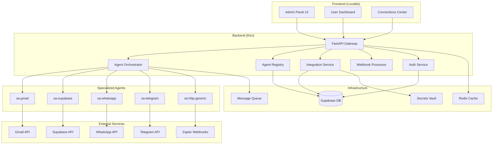

# Design Document

## Overview

Este documento apresenta o design técnico para a implementação do Sistema de Integrações Avançado e a transformação do módulo Teams para Módulo Multi-Agentes do projeto Renum. O sistema será composto por três componentes principais:

1. **Sistema de Integrações**: Webhooks e conectores para plataformas externas
2. **Módulo Multi-Agentes**: Orquestrador + Subagentes especializados
3. **Painel Superadmin**: Interface administrativa completa

A arquitetura seguirá os princípios de Clean Architecture, com separação clara entre camadas e responsabilidades bem definidas.

## Architecture

### High-Level Architecture



### Component Architecture

#### 1. Agent Orchestrator
- **Responsabilidade**: Interface principal com usuário, coordenação de subagentes
- **Localização**: `app/services/orchestrator_service.py`
- **Funcionalidades**:
  - Entrevista conversacional com usuário
  - Análise de requisitos e geração de planos
  - Seleção e coordenação de subagentes
  - Validação de credenciais necessárias
  - Execução de workflows multi-agentes

#### 2. Agent Registry
- **Responsabilidade**: Catálogo de subagentes aprovados
- **Localização**: `app/services/agent_registry_service.py`
- **Funcionalidades**:
  - CRUD de agentes especializados
  - Versionamento e aprovação
  - Manifesto JSON com capabilities
  - Distribuição para orquestrador

#### 3. Integration Service
- **Responsabilidade**: Gerenciamento de integrações externas
- **Localização**: `app/services/integration_service.py`
- **Funcionalidades**:
  - CRUD de integrações
  - Geração e validação de tokens
  - Rate limiting por integração
  - Analytics e monitoramento

#### 4. Webhook Processor
- **Responsabilidade**: Processamento de webhooks recebidos
- **Localização**: `app/services/webhook_service.py`
- **Funcionalidades**:
  - Validação de payloads
  - Roteamento para agentes corretos
  - Processamento assíncrono
  - Logs e auditoria

## Components and Interfaces

### 1. Database Schema

#### Core Tables

```sql
-- Agent Registry Tables
CREATE TABLE agents_registry (
    id UUID PRIMARY KEY DEFAULT gen_random_uuid(),
    agent_id VARCHAR(100) NOT NULL,
    version VARCHAR(20) NOT NULL,
    name VARCHAR(200) NOT NULL,
    description TEXT,
    capabilities JSONB NOT NULL,
    input_schema JSONB NOT NULL,
    policy JSONB NOT NULL,
    status VARCHAR(20) DEFAULT 'draft', -- draft, staged, approved, deprecated
    created_by UUID REFERENCES auth.users(id),
    created_at TIMESTAMP WITH TIME ZONE DEFAULT NOW(),
    updated_at TIMESTAMP WITH TIME ZONE DEFAULT NOW(),
    UNIQUE(agent_id, version)
);

-- Integration Tables
CREATE TABLE integrations (
    id UUID PRIMARY KEY DEFAULT gen_random_uuid(),
    user_id UUID REFERENCES auth.users(id) NOT NULL,
    name VARCHAR(200) NOT NULL,
    type VARCHAR(50) NOT NULL, -- whatsapp, telegram, zapier, n8n, make
    config JSONB NOT NULL,
    token VARCHAR(500) NOT NULL,
    webhook_url TEXT,
    status VARCHAR(20) DEFAULT 'active', -- active, inactive, error
    rate_limit_per_minute INTEGER DEFAULT 60,
    created_at TIMESTAMP WITH TIME ZONE DEFAULT NOW(),
    updated_at TIMESTAMP WITH TIME ZONE DEFAULT NOW()
);

-- Webhook Logs
CREATE TABLE webhook_logs (
    id UUID PRIMARY KEY DEFAULT gen_random_uuid(),
    integration_id UUID REFERENCES integrations(id),
    request_id VARCHAR(100),
    method VARCHAR(10),
    headers JSONB,
    payload JSONB,
    response_status INTEGER,
    response_body JSONB,
    processing_time_ms INTEGER,
    error_message TEXT,
    created_at TIMESTAMP WITH TIME ZONE DEFAULT NOW()
);

-- Multi-Agent Executions
CREATE TABLE multi_agent_executions (
    id UUID PRIMARY KEY DEFAULT gen_random_uuid(),
    user_id UUID REFERENCES auth.users(id) NOT NULL,
    orchestrator_session_id VARCHAR(100),
    plan JSONB NOT NULL, -- Generated execution plan
    status VARCHAR(20) DEFAULT 'pending', -- pending, running, completed, failed
    agents_used JSONB, -- List of agents used in execution
    total_cost DECIMAL(10,4),
    started_at TIMESTAMP WITH TIME ZONE,
    completed_at TIMESTAMP WITH TIME ZONE,
    created_at TIMESTAMP WITH TIME ZONE DEFAULT NOW()
);

-- Agent Execution Steps
CREATE TABLE agent_execution_steps (
    id UUID PRIMARY KEY DEFAULT gen_random_uuid(),
    execution_id UUID REFERENCES multi_agent_executions(id),
    agent_id VARCHAR(100),
    agent_version VARCHAR(20),
    step_order INTEGER,
    input_data JSONB,
    output_data JSONB,
    status VARCHAR(20) DEFAULT 'pending',
    error_message TEXT,
    execution_time_ms INTEGER,
    cost DECIMAL(10,4),
    started_at TIMESTAMP WITH TIME ZONE,
    completed_at TIMESTAMP WITH TIME ZONE,
    created_at TIMESTAMP WITH TIME ZONE DEFAULT NOW()
);

-- User Credentials (BYOC)
CREATE TABLE user_credentials (
    id UUID PRIMARY KEY DEFAULT gen_random_uuid(),
    user_id UUID REFERENCES auth.users(id) NOT NULL,
    service_type VARCHAR(50) NOT NULL, -- gmail, supabase, whatsapp, etc
    service_name VARCHAR(200), -- User-friendly name
    encrypted_credentials TEXT NOT NULL,
    scopes JSONB,
    expires_at TIMESTAMP WITH TIME ZONE,
    status VARCHAR(20) DEFAULT 'active', -- active, expired, error
    last_validated_at TIMESTAMP WITH TIME ZONE,
    created_at TIMESTAMP WITH TIME ZONE DEFAULT NOW(),
    updated_at TIMESTAMP WITH TIME ZONE DEFAULT NOW()
);

-- Feature Toggles
CREATE TABLE feature_toggles (
    id UUID PRIMARY KEY DEFAULT gen_random_uuid(),
    feature_name VARCHAR(100) NOT NULL,
    description TEXT,
    enabled_globally BOOLEAN DEFAULT false,
    tenant_rules JSONB, -- Rules for specific tenants
    rollout_percentage INTEGER DEFAULT 0,
    created_by UUID REFERENCES auth.users(id),
    created_at TIMESTAMP WITH TIME ZONE DEFAULT NOW(),
    updated_at TIMESTAMP WITH TIME ZONE DEFAULT NOW(),
    UNIQUE(feature_name)
);

-- Integration Analytics
CREATE TABLE integration_analytics (
    id UUID PRIMARY KEY DEFAULT gen_random_uuid(),
    integration_id UUID REFERENCES integrations(id),
    date DATE NOT NULL,
    total_requests INTEGER DEFAULT 0,
    successful_requests INTEGER DEFAULT 0,
    failed_requests INTEGER DEFAULT 0,
    avg_response_time_ms DECIMAL(10,2),
    total_cost DECIMAL(10,4),
    created_at TIMESTAMP WITH TIME ZONE DEFAULT NOW(),
    UNIQUE(integration_id, date)
);
```

#### RLS Policies

```sql
-- Enable RLS on all tables
ALTER TABLE agents_registry ENABLE ROW LEVEL SECURITY;
ALTER TABLE integrations ENABLE ROW LEVEL SECURITY;
ALTER TABLE webhook_logs ENABLE ROW LEVEL SECURITY;
ALTER TABLE multi_agent_executions ENABLE ROW LEVEL SECURITY;
ALTER TABLE agent_execution_steps ENABLE ROW LEVEL SECURITY;
ALTER TABLE user_credentials ENABLE ROW LEVEL SECURITY;
ALTER TABLE feature_toggles ENABLE ROW LEVEL SECURITY;
ALTER TABLE integration_analytics ENABLE ROW LEVEL SECURITY;

-- Policies for integrations (users can only see their own)
CREATE POLICY "Users can view own integrations" ON integrations
    FOR SELECT USING (auth.uid() = user_id);

CREATE POLICY "Users can insert own integrations" ON integrations
    FOR INSERT WITH CHECK (auth.uid() = user_id);

CREATE POLICY "Users can update own integrations" ON integrations
    FOR UPDATE USING (auth.uid() = user_id);

CREATE POLICY "Users can delete own integrations" ON integrations
    FOR DELETE USING (auth.uid() = user_id);

-- Policies for webhook logs (users can only see logs from their integrations)
CREATE POLICY "Users can view own webhook logs" ON webhook_logs
    FOR SELECT USING (
        integration_id IN (
            SELECT id FROM integrations WHERE user_id = auth.uid()
        )
    );

-- Policies for multi-agent executions
CREATE POLICY "Users can view own executions" ON multi_agent_executions
    FOR SELECT USING (auth.uid() = user_id);

CREATE POLICY "Users can insert own executions" ON multi_agent_executions
    FOR INSERT WITH CHECK (auth.uid() = user_id);

-- Policies for user credentials
CREATE POLICY "Users can manage own credentials" ON user_credentials
    FOR ALL USING (auth.uid() = user_id);

-- Admin policies for agents registry (only admins can manage)
CREATE POLICY "Admins can manage agents" ON agents_registry
    FOR ALL USING (
        EXISTS (
            SELECT 1 FROM auth.users 
            WHERE id = auth.uid() 
            AND raw_user_meta_data->>'role' = 'admin'
        )
    );

-- Public read access to approved agents
CREATE POLICY "Public can view approved agents" ON agents_registry
    FOR SELECT USING (status = 'approved');
```

### 2. API Endpoints

#### Agent Registry API

```python
# app/api/v1/agents.py

@router.get("/agents", response_model=List[AgentSchema])
async def list_agents(
    status: Optional[str] = None,
    agent_type: Optional[str] = None,
    current_user: User = Depends(get_current_user)
):
    """List available agents from registry"""
    pass

@router.get("/agents/{agent_id}", response_model=AgentDetailSchema)
async def get_agent(
    agent_id: str,
    version: Optional[str] = None,
    current_user: User = Depends(get_current_user)
):
    """Get specific agent details"""
    pass

@router.post("/agents", response_model=AgentSchema)
async def create_agent(
    agent_data: CreateAgentSchema,
    current_user: User = Depends(get_current_admin)
):
    """Create new agent (admin only)"""
    pass

@router.put("/agents/{agent_id}/approve")
async def approve_agent(
    agent_id: str,
    version: str,
    current_user: User = Depends(get_current_admin)
):
    """Approve agent for production use"""
    pass
```

#### Integration API

```python
# app/api/v1/integrations.py

@router.get("/integrations", response_model=List[IntegrationSchema])
async def list_integrations(
    current_user: User = Depends(get_current_user)
):
    """List user's integrations"""
    pass

@router.post("/integrations", response_model=IntegrationSchema)
async def create_integration(
    integration_data: CreateIntegrationSchema,
    current_user: User = Depends(get_current_user)
):
    """Create new integration"""
    pass

@router.get("/integrations/{integration_id}/analytics")
async def get_integration_analytics(
    integration_id: UUID,
    days: int = 30,
    current_user: User = Depends(get_current_user)
):
    """Get integration analytics"""
    pass

@router.post("/integrations/{integration_id}/regenerate-token")
async def regenerate_token(
    integration_id: UUID,
    current_user: User = Depends(get_current_user)
):
    """Regenerate integration token"""
    pass
```

#### Webhook API

```python
# app/api/v1/webhooks.py

@router.post("/webhook/{integration_id}")
async def receive_webhook(
    integration_id: UUID,
    request: Request,
    background_tasks: BackgroundTasks
):
    """Receive webhook from external service"""
    pass

@router.post("/webhook/{integration_id}/{platform}")
async def receive_platform_webhook(
    integration_id: UUID,
    platform: str,  # whatsapp, telegram, zapier
    request: Request,
    background_tasks: BackgroundTasks
):
    """Receive platform-specific webhook"""
    pass
```

#### Orchestrator API

```python
# app/api/v1/orchestrator.py

@router.post("/orchestrator/chat", response_model=OrchestratorResponseSchema)
async def chat_with_orchestrator(
    message: ChatMessageSchema,
    session_id: Optional[str] = None,
    current_user: User = Depends(get_current_user)
):
    """Chat with agent orchestrator"""
    pass

@router.post("/orchestrator/execute", response_model=ExecutionSchema)
async def execute_plan(
    plan: ExecutionPlanSchema,
    current_user: User = Depends(get_current_user)
):
    """Execute approved multi-agent plan"""
    pass

@router.get("/orchestrator/executions", response_model=List[ExecutionSchema])
async def list_executions(
    current_user: User = Depends(get_current_user)
):
    """List user's multi-agent executions"""
    pass
```

### 3. Service Layer Architecture

#### Orchestrator Service

```python
# app/services/orchestrator_service.py

class OrchestratorService:
    def __init__(self, agent_registry: AgentRegistryService):
        self.agent_registry = agent_registry
        self.conversation_memory = {}
    
    async def process_user_message(
        self, 
        user_id: str, 
        message: str, 
        session_id: str
    ) -> OrchestratorResponse:
        """Process user message and generate response"""
        # 1. Analyze user intent
        # 2. Conduct progressive interview if needed
        # 3. Generate execution plan when ready
        # 4. Validate required credentials
        pass
    
    async def generate_execution_plan(
        self, 
        requirements: Dict, 
        user_id: str
    ) -> ExecutionPlan:
        """Generate multi-agent execution plan"""
        # 1. Select appropriate agents from registry
        # 2. Define execution sequence
        # 3. Validate agent capabilities
        # 4. Estimate costs
        pass
    
    async def execute_plan(
        self, 
        plan: ExecutionPlan, 
        user_id: str
    ) -> ExecutionResult:
        """Execute multi-agent plan"""
        # 1. Validate user credentials for required services
        # 2. Execute agents in defined sequence
        # 3. Handle errors and fallbacks
        # 4. Collect metrics and costs
        pass
```

#### Agent Registry Service

```python
# app/services/agent_registry_service.py

class AgentRegistryService:
    async def get_available_agents(
        self, 
        capabilities: List[str] = None
    ) -> List[Agent]:
        """Get agents matching capabilities"""
        pass
    
    async def create_agent(
        self, 
        agent_data: CreateAgentData
    ) -> Agent:
        """Create new agent with versioning"""
        pass
    
    async def approve_agent(
        self, 
        agent_id: str, 
        version: str
    ) -> Agent:
        """Approve agent for production"""
        pass
    
    async def get_agent_manifest(
        self, 
        agent_id: str, 
        version: str = "latest"
    ) -> AgentManifest:
        """Get agent manifest for execution"""
        pass
```

## Data Models

### Core Schemas

```python
# app/schemas/agent.py

class AgentCapability(BaseModel):
    name: str
    description: str
    input_schema: Dict[str, Any]
    output_schema: Dict[str, Any]

class AgentManifest(BaseModel):
    agent_id: str
    version: str
    name: str
    description: str
    capabilities: List[AgentCapability]
    required_credentials: List[str]
    policy: Dict[str, Any]
    cost_per_execution: Optional[Decimal]

class Agent(BaseModel):
    id: UUID
    agent_id: str
    version: str
    name: str
    description: str
    capabilities: List[AgentCapability]
    input_schema: Dict[str, Any]
    policy: Dict[str, Any]
    status: str
    created_by: UUID
    created_at: datetime
    updated_at: datetime

# app/schemas/integration.py

class IntegrationConfig(BaseModel):
    """Base config for integrations"""
    pass

class WhatsAppConfig(IntegrationConfig):
    business_phone_number: str
    access_token: str
    webhook_verify_token: str

class TelegramConfig(IntegrationConfig):
    bot_token: str
    webhook_secret: Optional[str]

class Integration(BaseModel):
    id: UUID
    user_id: UUID
    name: str
    type: str
    config: Union[WhatsAppConfig, TelegramConfig, Dict[str, Any]]
    token: str
    webhook_url: Optional[str]
    status: str
    rate_limit_per_minute: int
    created_at: datetime
    updated_at: datetime

# app/schemas/orchestrator.py

class ChatMessage(BaseModel):
    message: str
    session_id: Optional[str] = None

class ExecutionStep(BaseModel):
    agent_id: str
    agent_version: str
    action: str
    parameters: Dict[str, Any]
    depends_on: Optional[List[int]] = None

class ExecutionPlan(BaseModel):
    plan_id: str
    description: str
    steps: List[ExecutionStep]
    estimated_cost: Decimal
    required_credentials: List[str]

class OrchestratorResponse(BaseModel):
    message: str
    session_id: str
    requires_input: bool
    suggested_plan: Optional[ExecutionPlan] = None
    missing_credentials: Optional[List[str]] = None
```

## Error Handling

### Error Categories

1. **Validation Errors**: Invalid input data, schema violations
2. **Authentication Errors**: Invalid tokens, expired credentials
3. **Authorization Errors**: Insufficient permissions, rate limits
4. **Integration Errors**: External API failures, network issues
5. **Business Logic Errors**: Invalid workflows, missing dependencies

### Error Response Format

```python
# app/core/exceptions.py

class APIError(Exception):
    def __init__(self, message: str, code: str, status_code: int = 400):
        self.message = message
        self.code = code
        self.status_code = status_code

class IntegrationError(APIError):
    pass

class OrchestratorError(APIError):
    pass

class AgentExecutionError(APIError):
    pass

# Error response schema
class ErrorResponse(BaseModel):
    error: str
    code: str
    message: str
    details: Optional[Dict[str, Any]] = None
    timestamp: datetime
```

### Error Handling Middleware

```python
# app/core/error_handlers.py

@app.exception_handler(APIError)
async def api_error_handler(request: Request, exc: APIError):
    return JSONResponse(
        status_code=exc.status_code,
        content={
            "error": exc.__class__.__name__,
            "code": exc.code,
            "message": exc.message,
            "timestamp": datetime.utcnow().isoformat()
        }
    )

@app.exception_handler(ValidationError)
async def validation_error_handler(request: Request, exc: ValidationError):
    return JSONResponse(
        status_code=422,
        content={
            "error": "ValidationError",
            "code": "VALIDATION_FAILED",
            "message": "Input validation failed",
            "details": exc.errors(),
            "timestamp": datetime.utcnow().isoformat()
        }
    )
```

## Testing Strategy

### Unit Tests

```python
# tests/test_orchestrator_service.py

class TestOrchestratorService:
    async def test_process_user_message_initial_contact(self):
        """Test initial user message processing"""
        pass
    
    async def test_generate_execution_plan_simple_workflow(self):
        """Test plan generation for simple workflow"""
        pass
    
    async def test_execute_plan_with_valid_credentials(self):
        """Test plan execution with valid credentials"""
        pass
    
    async def test_handle_missing_credentials(self):
        """Test handling of missing user credentials"""
        pass

# tests/test_integration_service.py

class TestIntegrationService:
    async def test_create_whatsapp_integration(self):
        """Test WhatsApp integration creation"""
        pass
    
    async def test_webhook_validation(self):
        """Test webhook payload validation"""
        pass
    
    async def test_rate_limiting(self):
        """Test rate limiting functionality"""
        pass

# tests/test_agent_registry.py

class TestAgentRegistry:
    async def test_agent_creation_and_versioning(self):
        """Test agent creation with proper versioning"""
        pass
    
    async def test_agent_approval_workflow(self):
        """Test agent approval process"""
        pass
    
    async def test_capability_matching(self):
        """Test agent selection by capabilities"""
        pass
```

### Integration Tests

```python
# tests/integration/test_webhook_flow.py

class TestWebhookFlow:
    async def test_whatsapp_webhook_to_agent_execution(self):
        """Test complete flow from WhatsApp webhook to agent execution"""
        pass
    
    async def test_telegram_webhook_processing(self):
        """Test Telegram webhook processing"""
        pass

# tests/integration/test_multi_agent_execution.py

class TestMultiAgentExecution:
    async def test_orchestrator_to_execution_flow(self):
        """Test complete orchestrator to execution flow"""
        pass
    
    async def test_error_handling_in_execution(self):
        """Test error handling during multi-agent execution"""
        pass
```

### Performance Tests

```python
# tests/performance/test_webhook_performance.py

class TestWebhookPerformance:
    async def test_webhook_processing_under_load(self):
        """Test webhook processing performance under load"""
        pass
    
    async def test_rate_limiting_accuracy(self):
        """Test rate limiting accuracy under concurrent requests"""
        pass
```

## Security Considerations

### Authentication & Authorization

1. **JWT Tokens**: Supabase JWT for user authentication
2. **API Keys**: Secure token generation for integrations
3. **RBAC**: Role-based access control for admin functions
4. **RLS**: Row-level security in Supabase

### Data Protection

1. **Encryption at Rest**: User credentials encrypted in database
2. **Encryption in Transit**: HTTPS/TLS for all communications
3. **PII Masking**: Sensitive data masked in logs
4. **Credential Isolation**: BYOC model for user credentials

### Security Headers

```python
# app/core/security.py

SECURITY_HEADERS = {
    "X-Content-Type-Options": "nosniff",
    "X-Frame-Options": "DENY",
    "X-XSS-Protection": "1; mode=block",
    "Strict-Transport-Security": "max-age=31536000; includeSubDomains",
    "Content-Security-Policy": "default-src 'self'",
    "Referrer-Policy": "strict-origin-when-cross-origin"
}

@app.middleware("http")
async def add_security_headers(request: Request, call_next):
    response = await call_next(request)
    for header, value in SECURITY_HEADERS.items():
        response.headers[header] = value
    return response
```

### Rate Limiting

```python
# app/core/rate_limiting.py

class RateLimiter:
    def __init__(self, redis_client):
        self.redis = redis_client
    
    async def check_rate_limit(
        self, 
        key: str, 
        limit: int, 
        window: int
    ) -> bool:
        """Check if request is within rate limit"""
        current = await self.redis.get(key)
        if current is None:
            await self.redis.setex(key, window, 1)
            return True
        
        if int(current) >= limit:
            return False
        
        await self.redis.incr(key)
        return True
```

This design provides a comprehensive foundation for implementing the multi-agent system with integrations and admin panel, following clean architecture principles and ensuring scalability, security, and maintainability.