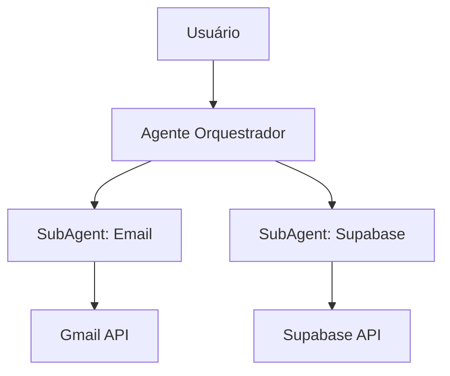

# Atualização & Transformação: Módulo Teams → Módulo Multiagentes (RENUM)

**Autor:** Luma (Gerente de Projeto)  
**Destinatário:** Renato Carraro  
**Base:** Análises e documentos fornecidos (comparativo de funcionalidades, relatório de implementação e documento técnico do módulo multiagentes).

---

## 1. Objetivo deste documento
Consolidar uma proposta técnica e tática para transformar o módulo **Teams (Equipe)** existente em um **Módulo Multiagentes** reutilizando ao máximo a base atual, reduzindo retrabalho e acelerando a entrega de valor da IA orquestrada.

O foco é:
- Mapear sobreposições entre **Teams** e **Multiagentes**;
- Definir a arquitetura alvo, dados, APIs e UX mínimos necessários;
- Entregar um backlog estruturado (épicos e tickets) com critérios de aceite claros;
- Apresentar estratégias de migração e mitigação de riscos.

---

## 2. Resumo da análise
1. **Alta sinergia**: o módulo Teams já contém conceitos de organização, permissões, membros, templates — diretamente aproveitáveis no catálogo de agentes e RBAC do módulo multiagentes.  
2. **Gaps críticos**: funcionalidades essenciais para multiagentes (catálogo, execução orquestrada, registry de subagentes, audit logs e billing por execução) não existem no Teams e precisam ser criadas.  
3. **Reaproveitamento possível**: UI de administração de equipes, templates e gestão de credenciais podem ser estendidas.

---

## 3. Arquitetura proposta (alto nível)
- **Agente Orquestrador (AO)**: backend responsável por criar/validar/executar workflows com subagents.  
- **Agents Registry**: serviço/tabela com manifestos versionados de agentes.  
- **Tenant Connections (BYOC)**: central de credenciais segura, estendendo o Teams.  
- **Workflow Engine / Executor**: transforma plano em execução step-by-step, com logs e métricas.  
- **Billing & Metering**: coleta métricas de uso por execução/tenant.  
- **UI**: aproveita telas do Teams (equipes, templates, conexões) adaptando para catálogo e execução multiagente.  
- **Segurança/Observabilidade**: herda requisitos críticos do gap analysis (validação, audit, APM).

---

## 4. Estrutura técnica (sugestão)
### Tabelas novas/alteradas
- `agents_registry`  
- `tenant_connections` (estendido)  
- `workflows`  
- `workflow_runs`  
- `execution_logs`  
- `integration_requests`  
- `billing_metrics`  

### Endpoints principais
- `POST /api/orchestrator/plan`  
- `POST /api/orchestrator/validate`  
- `POST /api/orchestrator/execute`  
- `GET /api/workflows/:id/runs/:run_id/logs`  
- `GET /api/agents`  
- `POST /internal/agents/{agent_id}:{version}/execute`  

---

## 5. UX / Telas principais
1. **Orquestrador (entrada)**: chat/formulário → gera plano visual de fluxo.  
2. **Central de Conexões (BYOC)**: conexões por tenant, status, revalidação.  
3. **Catálogo de Agentes**: listagem versionada, docs embutidas.  
4. **Editor Visual/JSON**: arrastar/soltar para ajustar plano.  
5. **Execução & Monitor**: logs em tempo real, histórico de runs.  
6. **Admin/RBAC**: permissões para publicar, executar e auditar agentes.

---

## 6. Backlog estruturado (épicos)
- **Épico A — Catálogo de Agentes** (registry + UI + endpoint execute).  
- **Épico B — Orquestrador & Planos** (plan/validate + geração JSON).  
- **Épico C — BYOC & Tenant Connections** (estender + UI de conexões).  
- **Épico D — Executor & Resiliência** (workflows/runs, retries, circuit breaker).  
- **Épico E — Observability & Billing** (audit logs, métricas, APM).  
- **Épico F — UX Avançado & Templates** (editor visual, templates compartilhados).

---

## 7. Estratégia de Migração
1. Extrair templates e conexões do Teams → migrar para `agents_registry` e `tenant_connections`.  
2. Habilitar **modo híbrido** (Teams + Multiagentes em paralelo, flag `feature.multiagents`).  
3. Migrar dados com rotação de secrets.  
4. Piloto com 2–3 tenants antes do rollout.  
5. Rollback: manter versão Teams ativa para contingência.

---

## 8. Riscos e Mitigações
- **Credenciais expostas** → criptografia forte e masking.  
- **Sobrecarga de execuções** → circuit breaker + fila de workers.  
- **Falta de agentes críticos** → subagent genérico HTTP + conectores temporários.

---

## 9. Diagramas
### ASCII
```
Usuário → Orquestrador → Subagents → APIs externas
```
### Mermaid


---

## 10. Próximos passos
1. Workshop técnico com Kiro + Lovable + DevOps para alinhar épicos A–E.  
2. Criar backlog no Jira/Linear com tickets do item 6.  
3. Escolher tenant piloto para `feature.multiagents`.  
4. Priorizar segurança e DB (Fundação) antes de execuções abertas.

---

**Observação:** Este documento é uma síntese entre o módulo Teams, os gaps identificados e o documento técnico multiagente.  
